# 🍊 Plataforma Orange Evolution

  

<p align="justify">Projeto da quarta edição do Hackathon da Orange Juice. Criamos essa plataforma com o intuito de proporcionar aos usuários do Orange Evolution uma nova experiência de estudos, visando eliminar os problemas do molde antecessor.

<p>Conheça a comunidade da Orange Juice e a plataforma de estudos que nos baseamos: <a href="https://digital.fcamara.com.br/orangejuice">Orange Juice</a></p>


---

## 🛠️ Construído com

* [React](https://pt-br.reactjs.org/) - O framework web usado
* [MUI](https://mui.com/material-ui/getting-started/templates/album/) - Biblioteca de estilização

---

## 📘 Pré-requisitos

* [Vite](https://vitejs.dev/)
* [Node.Js](https://nodejs.org/en/)
* [NPM](https://www.npmjs.com/)

---

## 📖 Iniciando a aplicação

<p>Rode os comandos a seguir no terminal ou PoweShell.</p>

- Clone o repositório:

```
git clone https://github.com/fcsquad17/Plataforma-Orange-Evolution.git
```

- Acesse a pasta:

```
cd Plataforma-Orange-Evolution
```

- Instale os pacotes necessários:

```
npm i --production
```

- Inicie o servidor:

```
npm run dev
```

- Pressione ctrl + click esquerdo no link gerado:

```
Local: http://127.0.0.1:5173/
```

<p>Ao iniciar o projeto, o servidor será aberto em http://127.0.0.1:5173/</p>

---

## ✔️ Features

Usuários:
- [x] Cadastro de usuário
- [x] Meu perfil
- [x] Trilhas com progressão
- [x] Aba de eventos

Administradores:
- [x] Visualização das trilhas
- [x] Painel de controle sobre todos os conteúdos

---

## 💻 Demonstração da plataforma

### 📄 Onboarding

<p>O primeiro contato que usuários/administradores terão será com a página Onboarding, nela será demonstrado as informações do Orange Evolution e Trilhas:</p>

<h1 align="center">
  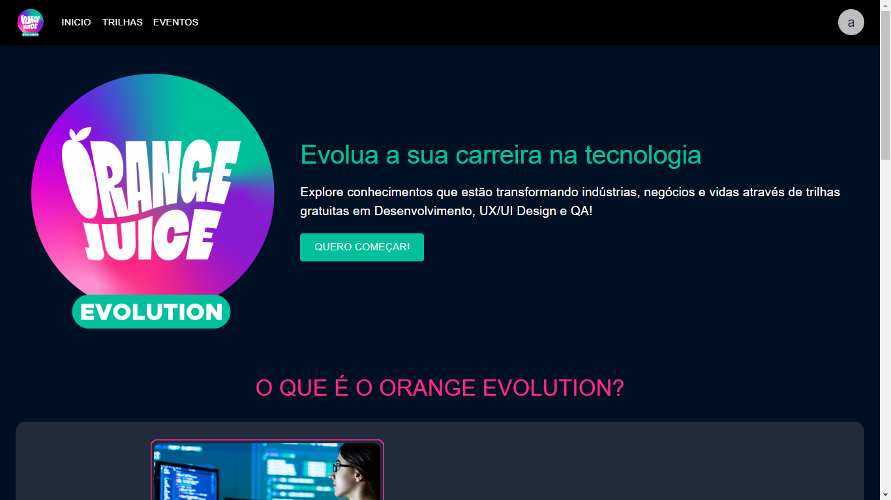
</h1>

### 📄 Login e Cadastro

<p>Logo em seguida será necessário que o usuário faça login ou um novo cadastro como demonstrado abaixo.</p>
<p>No caso dos administradores, os mesmos poderão fazer o login com o usuário e senha padrão:</p> 
<ul>
  <li>Email: admin@admin.com</li>
  <li>Senha: admin</li>
</ul>
<h1 align="center">
  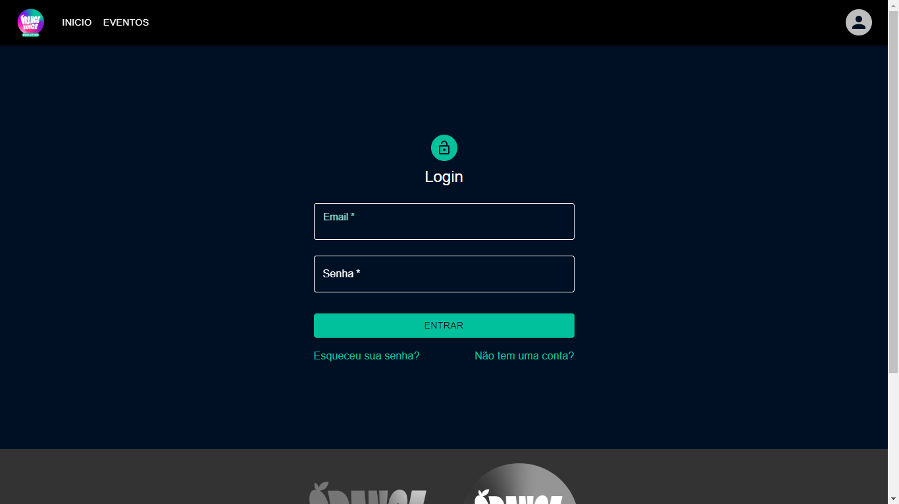
</h1>
<h1 align="center">
  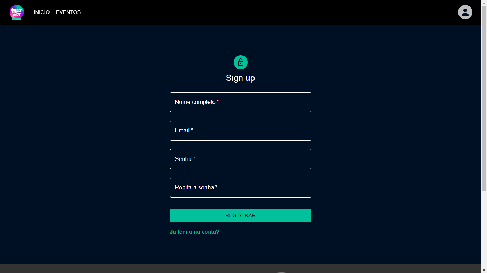
</h1>

### 📄 Esqueci minha senha e Redefinição

<p>Páginas para redefinição de senha em caso de esquecimento. A idéia
é que seja enviado uma senha-código para o email do usuário e o mesmo
possa redefini-la na segunda tela usando o código recebido por email.
A funcionalidade não foi implementada porém está desenhada para futuras
atualizações.</p>

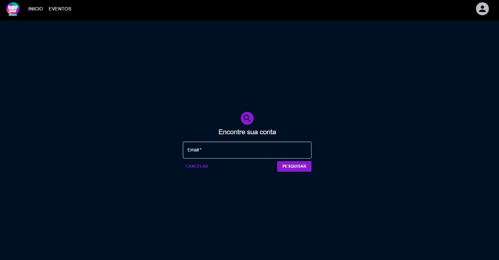
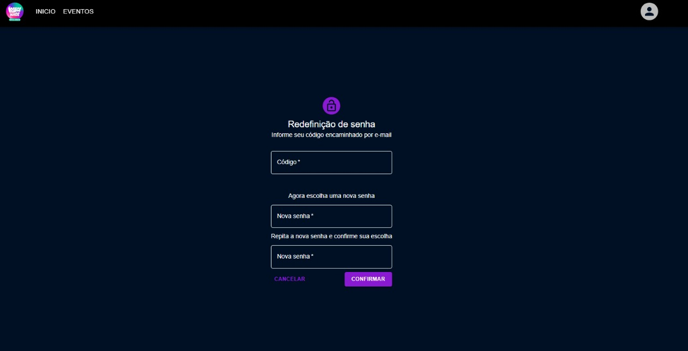

### 📄 Trilhas

<p>Após o usuário realizar o login, o mesmo será redirecionado para a aba de trilhas, onde será disposto todas as trilhas diponíveis. As trilhas de sua escolha serão adicionadas no quadrante "Continue de onde parou:", há também uma barra de porcentagem logo abaixo de cada card das trilhas que a ele pertencem, dando assim uma orientação sobre o seu progresso.</p>
<p>Os administradores também terão acesso a aba de trilhas.</p>
<h1 align="center">
  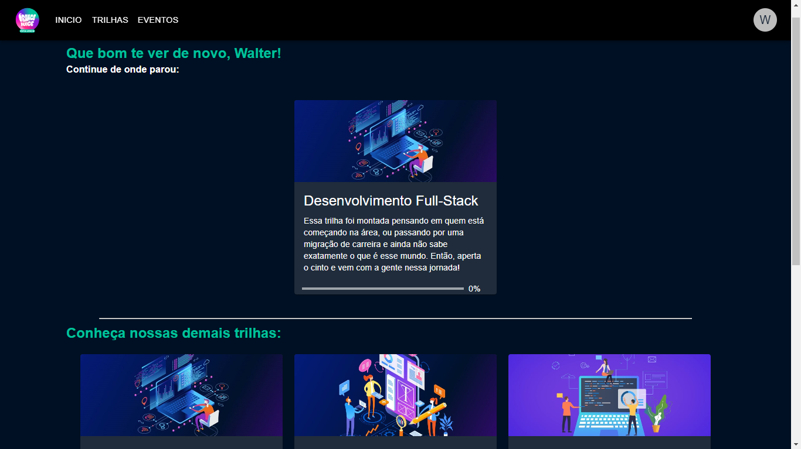
</h1>

### 📄 Módulos

<p>Após o usuário ter feito a escolha da(s) trilha(s), ele poderá clicar nela(s) e ser redirecionado para a página dos módulos pertencentes as mesmas.</p>
<h1 align="center">
  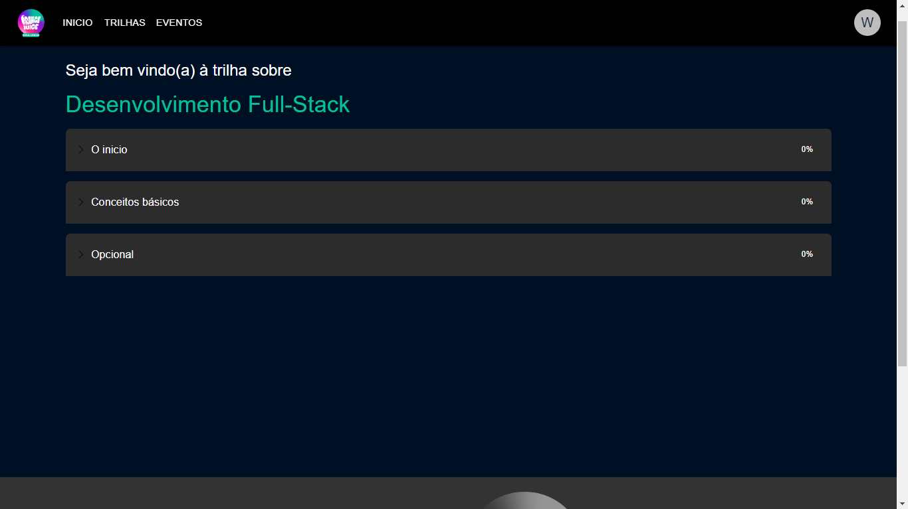
</h1>
<p>Ao clicar em algum módulo, o mesmo será expandido mostrando todos os seus conteúdos. Para cada conteúdo há os seguintes botões:</p>

<ul>
  <li><strong>continuar:</strong> Vai para o próximo conteúdo;</li>
  <li><strong>acessar link:</strong> Encaminha o usuário para a página do conteúdo;</li>
  <li><strong>voltar:</strong> retorna para o conteúdo anterior.</li>
</ul>

<P>Há também barras de porcentagem dispostas ao lado direito de cada módulo indicando o progresso do usuário em cada um dos mesmos</p>
<h1 align="center">
  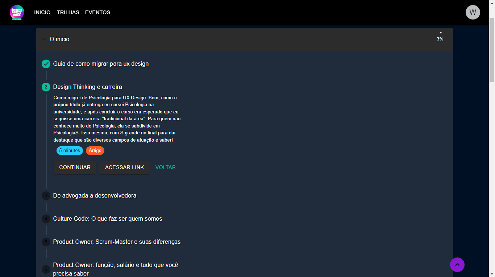
</h1>

### 📄 Perfil

<p>Os usuários também contam com a página de perfil, nela é possível alterar os dados informados no ato do registro:</p>
<h1 align="center">
  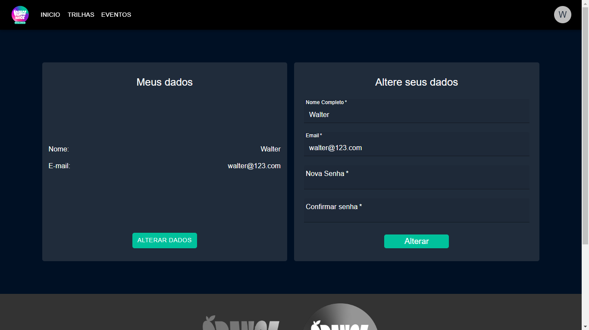
</h1>

### 📄 Painel de Controle

<p>Já para os administradores, após a realização de login os mesmos serão direcionados para o painel de controle. Esta página tem o intuito de controlar todos so conteúdos da plataforma:</p>

<h1 align="center">
  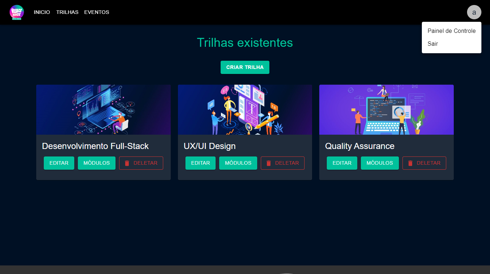
</h1>

<p>As imagens a seguir representam cada função dentro do painel de controle:

### 📄 Criação/Edição de trilhas

<h1 align="center">
  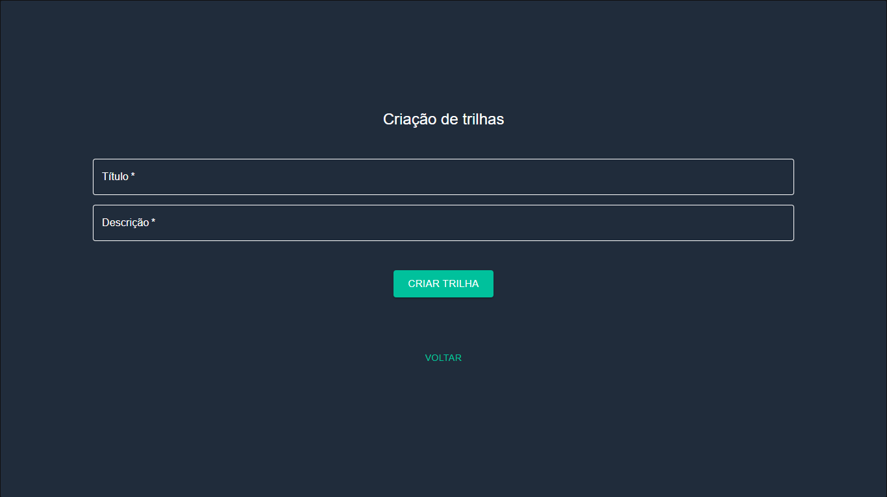
</h1>
<h1 align="center">
  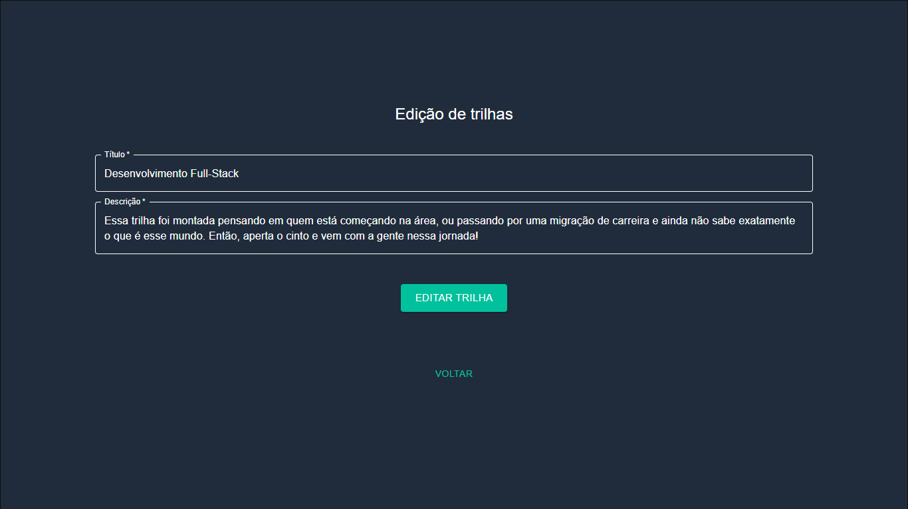
</h1>

### 📄 Criação/Edição de módulos

<h1 align="center">
  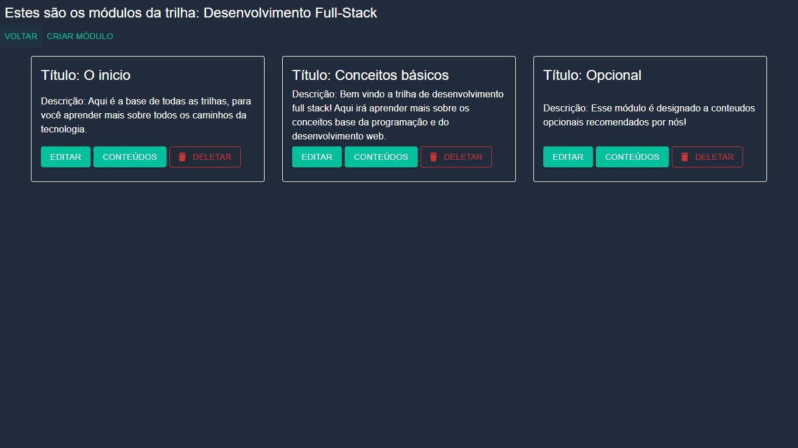
</h1>

### 📄 Criação/Edição de conteúdos

<h1 align="center">
  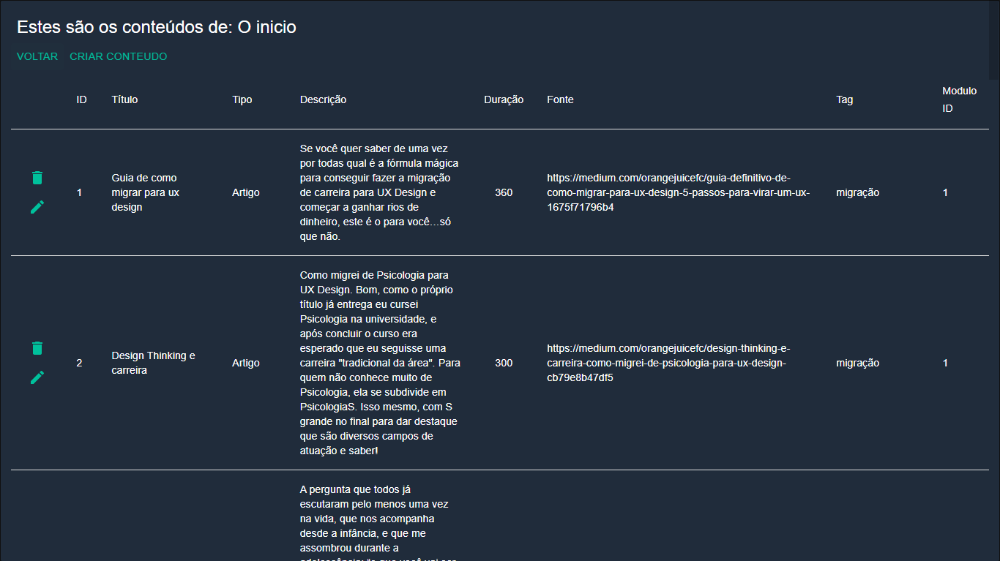
</h1>

### 📄 Eventos

<p>Há também a presença de uma aba Eventos na barra de navegação, o intuito desse aba é quê, futuramente, os anúncios da Orange Juice/Orange Evolution também possam ser feitos diretamente na plataforma:</p>

<h1 align="center">
  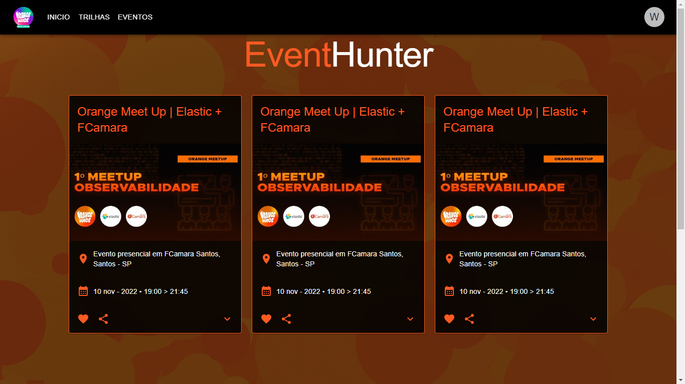
</h1>

### 📄 Responsividade

<p>Lembrando que toda a plataforma conta com elementos responsivos, se adequando a inúmeros formatos e tamanhos de tela como demonstrado abaixo:</p>

<h1 align="center">
  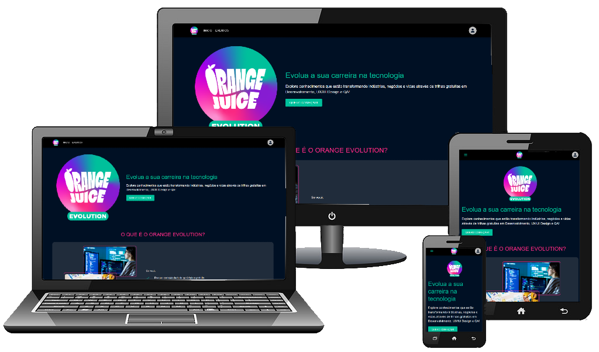
</h1>

---

## 🏁 Conclusão

<p>A plataforma roda com acertividade, sabemos dos problemas internos que o projeto Front e Back-end sofrem porém a ideia dessa construção é que fosse um MVP (Minimum Viable Project). Com isso, optamos por usar as tecnologias e ferramentas que mais fossem cabiveis de acordo com a ideia do projeto como um todo.</p>

---

## ✏️ Considerações finais

<p>Gostariamos de agradecer ao grupo FCamara e a Orange Juice por nos dar a oportunidade de participar de um evento como foi esse Hackathon, aprendemos muita coisa em 15 dias sendo desde algo mais complexo como a utilização do react até coisas mais simples como por exemplo realizar uma boa estruturação de pastas. Dedicamos todo o nosso esforço  para alcançar o melhor resultado possível, tentando assim escrever nossa própria história enquanto demonstravamos nossas ideias visando a melhor solução cabível para a problemática do processo.</p>

---

## Meu time 🥇

| [<br><sub>Hudson Lima</sub>](https://github.com/hudson-uchoa) | [<br><sub>Bruno Lupi</sub>](https://github.com/lupibruno) | [<br><sub>Walter dos Santos</sub>](https://github.com/WalterDSTS) |
| :-------------------------------------------------------------------------------------------------------------------------------------: | :---------------------------------------------------------------------------------------------------------------------------------: | :------------------------------------------------------------------------------------------------------------------------------------------: |